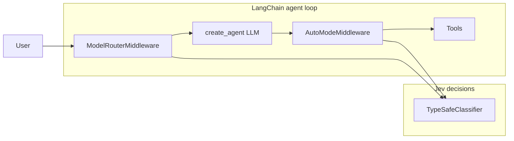

# Jev + LangChain agent harness (PoC)

Minimal proof of concept showing **Jev** (TypeSafe System One) as a **decision layer** on top of LangChain—not a chat UI.

- **Jev** (`TypeSafeClassifier`): typed judgments (Choice / Score / Noul) with calibrated probabilities.
- **LLM** (OpenAI via LangChain): text generation and tool selection inside `create_agent`.
- **Harness**: experimental middleware that calls Jev at agent lifecycle hooks (model routing, tool-risk gating).
- **PR risk**: a GitHub Action that labels each pull request `risk:high|moderate|low` and leaves a sticky comment.

Inspired by [Building a harness with Jev](https://www.langchain.com/blog/building-a-harness-with-jev) and the [LangChain TypeSafe integration](https://docs.langchain.com/oss/python/integrations/providers/typesafe). Jev product docs: [docs.typesafe.ai](https://docs.typesafe.ai).

## Requirements

- Python 3.11+
- [uv](https://docs.astral.sh/uv/) (recommended) or pip

## Install

```bash
cd /path/to/repo
uv sync
# or: pip install -e ".[experimental]"  # after adding a build backend if you prefer pip
```

With pip and no `uv`:

```bash
python3 -m venv .venv
source .venv/bin/activate
pip install "langchain-typesafe[experimental]" langchain langchain-openai python-dotenv
```

## Environment

Copy `.env.example` to `.env` and set:

| Variable | Required | Purpose |
|----------|----------|---------|
| `TYPESAFE_API_KEY` | Yes | Jev / TypeSafe API (classifier + middleware) |
| `OPENAI_API_KEY` | No | Live `create_agent` run; omit to use harness `--dry-run` |

```bash
cp .env.example .env
export TYPESAFE_API_KEY="your-key"
# optional:
export OPENAI_API_KEY="sk-..."
```

## 1. Email triage classifier (primary happy path)

One `TypeSafeClassifier.invoke` answers four questions: category (Choice), urgency (Score), `needs_human` and `actionable` (Noul).

```bash
uv run python scripts/classify_email.py --sample outage
uv run python scripts/classify_email.py --sample billing
uv run python scripts/classify_email.py --sample spam
uv run python scripts/classify_email.py --sample sales
uv run python scripts/classify_email.py -f samples/urgent_outage.txt
uv run python scripts/classify_email.py "Quick question about my invoice"
```

Samples live in `samples/` (outage, billing, spam, calm sales).

## 2. Agent harness (middleware)

Demonstrates:

- `ModelRouterMiddleware` — Jev **Choice** between fast (`gpt-4o-mini`) and powerful (`gpt-4o`) models.
- `AutoModeMiddleware` — Jev **Noul** risk gate on `delete_all_backups`; `lookup_docs` is unlisted and runs without classification.

**Dry-run** (only `TYPESAFE_API_KEY`): runs the same Jev classifiers the middleware uses, prints route and whether the risky tool would be blocked—no OpenAI calls.

```bash
uv run python scripts/agent_harness.py --dry-run
uv run python scripts/agent_harness.py --dry-run -m "Look up the backup retention runbook"
```

**Full agent** (requires `OPENAI_API_KEY`):

```bash
uv run python scripts/agent_harness.py
uv run python scripts/agent_harness.py -m "Delete all backups now"
```

## Layout

```
scripts/
  classify_email.py   # CLI email triage with TypeSafeClassifier
  agent_harness.py    # create_agent + ModelRouter + AutoMode
pr_risk/              # PR risk classifier (Jev + path rules + GitHub Action)
  samples/            # query / endpoint / CSS diffs
.github/workflows/pr-risk.yml
samples/              # email fixtures
tests/                # policy and path-rule unit tests
pyproject.toml
.env.example
```

## How it fits together



Middleware imports match `langchain-typesafe==0.0.1a2`:

```python
from langchain_typesafe.experimental.middleware import (
    AutoModeMiddleware,
    ModelChoice,
    ModelRouterMiddleware,
)
```

## 3. PR risk classifier (GitHub Action)

Each pull request is labeled `risk:high`, `risk:moderate`, or `risk:low` from **path rules in code** plus a batched Jev call per file. Jev answers narrow Noul questions; the tier is decided in Python.

| Tier | Review policy |
|------|----------------|
| `high` | Must not merge without review by someone from the data team. Queries, migrations, data models, or business logic. |
| `moderate` | Needs 2 approvals from engineers. Endpoints, code flows, runtime chores. |
| `low` | Ready to merge after a light review. UI/copy, tests, docs, simple fixes. |

### Enable

1. Create a [TypeSafe API key](https://docs.typesafe.ai).
2. Add it as the repository secret **`TYPESAFE_API_KEY`**.
3. Keep the workflow at `.github/workflows/pr-risk.yml`. If the secret is missing, the job logs that and exits `0` so the PR does not go red.

The action writes one sticky comment (updated on re-runs) and replaces any previous `risk:*` label.

### Run locally

```bash
uv sync --group dev
uv run pytest
uv run python -m pr_risk --sample query
uv run python -m pr_risk --diff-file pr_risk/samples/new_endpoint.diff
uv run python -m pr_risk --pr-url https://github.com/OWNER/REPO/pull/123
```

`--pr-url` needs `GITHUB_TOKEN`. `--github-event` is what CI uses.

### Tune rules and thresholds

- Path globs and skip lists: the tables at the top of `pr_risk/rules.py`.
- Signal and confidence cutoffs: the named constants at the top of `pr_risk/policy.py` (`HIGH_SIGNAL_THRESHOLD`, `MODERATE_SIGNAL_THRESHOLD`, `LOW_CONFIDENCE`).
- Jev questions: `pr_risk/jev.py`. Keep them narrow; do not move the tier decision into the prompt.

If a deciding Noul is near 0.5 (low derived confidence), the policy bumps the tier up one step.

### Optional branch protection

Map the labels onto repo rules; the action only labels and comments.

- `risk:high` — require a review from the data team via [CODEOWNERS](https://docs.github.com/en/repositories/managing-your-repositorys-settings-and-features/customizing-your-repository/about-code-owners) on data paths (`**/migrations/**`, `**/*.sql`, models/schema).
- `risk:moderate` — require 2 approving reviews.
- `risk:low` — keep the default light review.

## License

MIT (PoC — use at your own risk).
